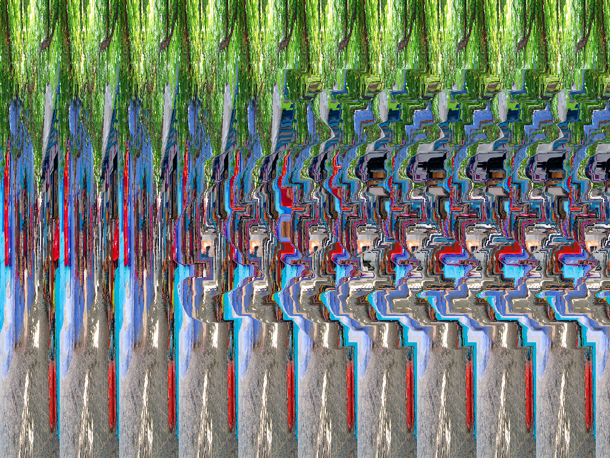
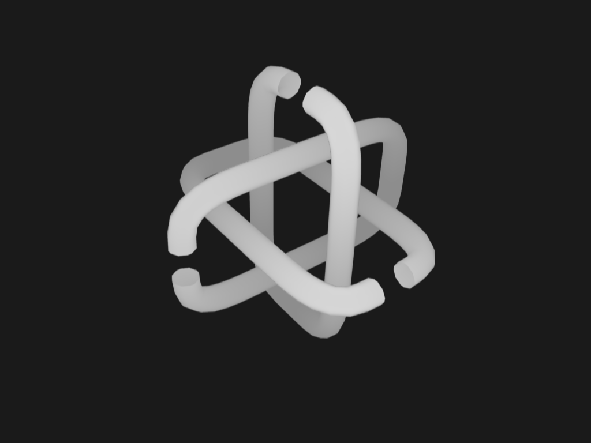

imagic
======

"Image Magic" autostereogram generator.

Go Import
=========

```
import (
    "github.com/cartland/imagic"
)
```

Hosted Service
==============

Try it online at https://imagic-golang.appspot.com.

Or try this curl request from a directory with Chefchaouen.jpg and borrodepth.png:

```
curl -F "background=@Chefchaouen.jpg" -F "depth=@borrodepth.png" https://imagic-golang.appspot.com/generate -o file_output.png

curl "https://imagic-golang.appspot.com/generate?background=http%3A%2F%2Fwww.chriscartland.com%2Fstatic%2FChefchaouen.jpg&depth=http%3A%2F%2Fwww.imsc.res.in%2F~kapil%2Fgeometry%2Fborr%2Fborrodepth.png" -o url_output.png
```

Source in `/appengine`.

Command Line
============

To run the command-line tool, use the following command from the project root:
```
go run imagic/example.go -d imagic/borrodepth.png -b imagic/Chefchaouen.jpg -o imagic/output.png
```

You can also use the optional `-c` flag for cross-eyed viewing and `-i` to invert the depth map.

Source in `/imagic`.





Depth map image borrowed from http://www.imsc.res.in/~kapil/geometry/borr/borrodepth.png.
